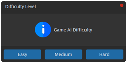

# Connect4 Game - Minimax with Alpha-beta pruning

Connect 4 game with Minimax AI implementation provides an engaging and challenging gaming experience for users. The application can be used by educational institutions, parents, and companies as a tool for promoting logical thinking, strategic planning, and problem-solving skills. Additionally, it offers an opportunity for developers and researchers to study and improve upon the AI method used in the game.

- First, the user selects the game difficulty level: Easy, Medium, Hard



- Then choose player color: red or yellow:       


- Play:


## Required Packages
- CustomTkinter
- CTkMessagebox
- tqdm


### Install
```
pip3 install -r requirements.txt
```

## Directory Structure
Place all the files in same directory as the following:
```
├─── plots/      contains plots   
├─── game.py     contains Connect4Game represents the Connect 4 game  
├─── player.py   contains MinimaxAlphaBetaPlayer: a player that uses the Minimax algorithm with alpha-beta pruning to make decisions in a Connect4Game
├─── app.py      contains Connect4App: main application class for the Connect 4 game
├─── evaluate.py contains evalation of ai players
└─── run.py      main script to run the game
```

### Play
```
python run.py
```

### Evaluate
```
python evaluate.py
```
